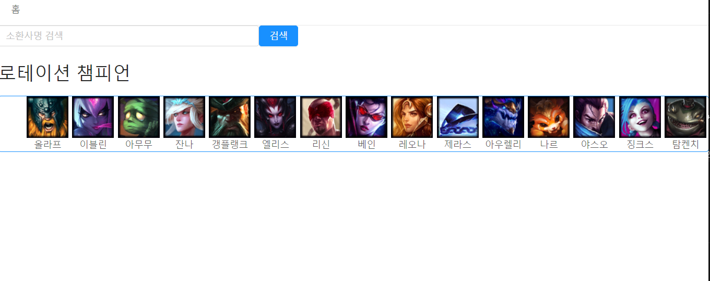
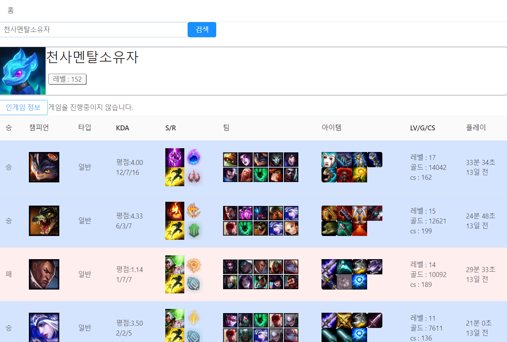
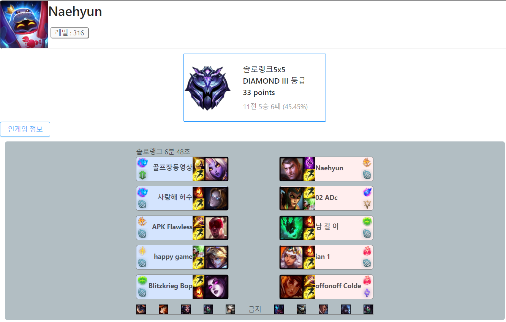
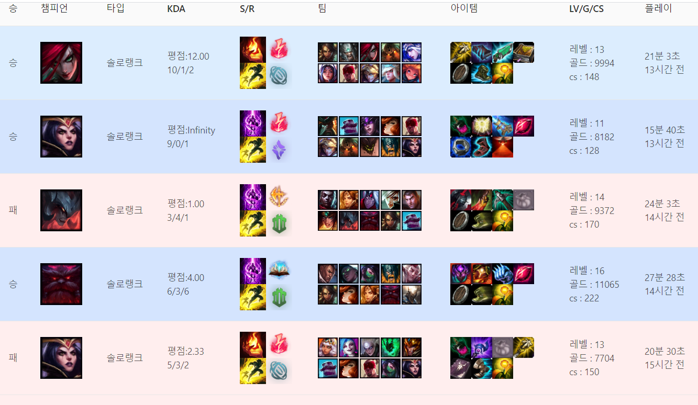

# 리그오브레전드 전적 검색 사이트 구현하기

시작일 : 2020. 1. 3 ~ 

사용 기술 : react, redux, redux-saga, express

코딩야학 7기 프로젝트 10일만에 만들기!! 동기부여가 될 거 같아서 바짝 공부하면서 구현해보려고 정함.
롤은 원래 좋아하던 게임이니까 구현하는 것도 재미있을거 같아서 정했다.
생각보다 쉽진 않지만 재밌는 것 같다.

제로초님 강의 들은 것 토대로 구글링 열심히 해가며 머리 쥐어짜내며 열심히 해볼 예정!!

### 처음 들어 갔을 때 메인 화면

### 유저를 검색 했을 때의 페이지

### 티어가 있는 유저 검색 및 해당 유저 게임 진행 상황 보기

### 검색한 유저의 최근 10전 전적 보기

